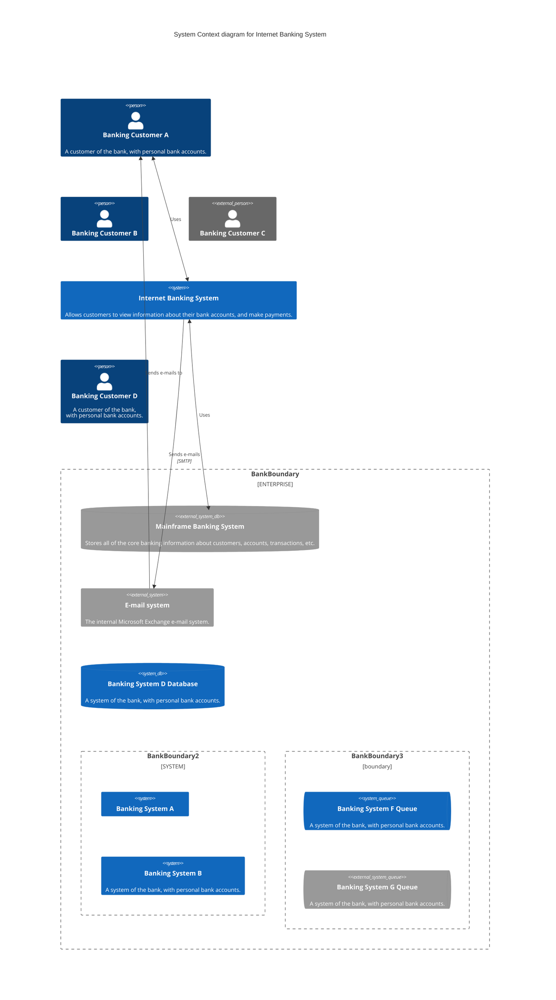
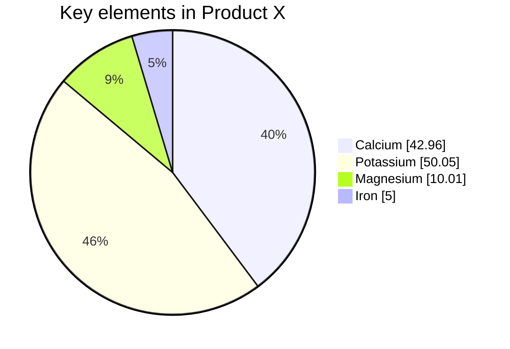

# Local-Monuments-Website
This project is containerized web application created form scratch. Whole application is totally my autorship. This project show plenty of ways to run this app but I recommend you to choose the standard Docker commands or Docker Compose because of they complexity and short time required to run an app. When you already run this app you could enter [localhost](https://localhost:80) (default port 80) to see page interface where you can click to see next slide with next Poland's monument.
 
 

---

# Tools used in the project
*Main tools:* [](https://www.python.org/) [](https://www.python.org/) [](https://www.docker.com/) <br>
*Python libraries:* `Flask`, `Psycopg2` 
<br>
*Other tools:* `Kubernetes`, `Docker Compose`, `Docker Swarm`

# Stack
- Python
- Django
- Psycopg2
- PostgreSQL
- Docker
- Docker Compose
- Docker Swarm Stack
- Kubernetes
- Nginx
- Bash
- Linux
- Git
- Gunicorn WSGI server
- Web Lanuages (HTML, CSS, JavaScript)

# Project structure
```$ tree Local-Monuments-Website
.
├───.idea
│   └───...
├───.git
│   └───...
├───docker-compose.yml
├───docker-stack.yml
├───infrastructure.yml
├───README.md
├───LICENSE
└───services
    ├───database
    │   ├───Connecting.txt
    |   └───Dockerfile
    ├───proxy-server
    │   ├───conf
    |   └───Dockerfile
    └───WSGI-server
        ├── Dockerfile
        ├── .dockerignore
        ├── infrastructure.png
        ├── docker-entrypoint.sh
        ├── main_python_files
        │   ├── __init__.py
        │   ├── config.py
        │   ├── init_db.py
        │   └── routes.py
        ├── requirements.txt
        ├── run.py
        └── src                    
            ├── static
            │   ├── css
            │   │   ├── about.css
            │   │   ├── base.css
            │   │   ├── gallery.css
            │   │   └── home.css
            │   └── js
            │       ├── base.js
            │       ├── gallery.js
            │       └── home.js
            └── template
                ├── about.html
                ├── base.html
                ├── gallery.html
                └── home.html
```

---

# How to run app
> **Note**
> xxx

## Requirments
Whatever method to run the application you will chose you need to have [Docker](https://www.docker.com/) installed you your computer. You can download docker on any OS [here](https://docs.docker.com/get-docker/). If you already have a Docker you will have to download only a images used by containers but this process should consume not more that 400 MB and is automatically performed before each container is launched (every container use lightweight versions of the images to reduce memory and time while building them, and reduce vulnerabilities).

# Recommended method:
## Docker Compose

To run app with compose file you have to create directory wherever you want and then clone from that repo...docker-compose up -d if...ordocker-compose up

# Other methods:
## Docker commands
You can deploy localy this app by creating containers one by one by using docker commands in some kind of terminal like e.g Powershell, cmd. The order of the command isn't important.
Run your nginx proxy server by this command:
```shell
docker container run -d --name nginx-server --network flask_network -p 80:80 JakubSzuber/custom-nginx
```

Run your main container responsible for the application logic (this container contains all necessary files) by this command:
```shell
docker container run -d --name gunicorn-server -p 5000:5000 --network flask_network JakubSzuber/custom-gunicorn
```

Run your postgres database by this command
```shell
docker container run -d --name postgres-database --network flask_network -e POSTGRES_USER=admin -e POSTGRES_PASSWORD=admin -e POSTGRES_DB=flask_db -v postgres_data:/var/lib/postgresql/data -p 5432:5432 postgres:15-alpine
```

## Docker Swarm commands
You can deploy localy this app by creating containers one by one by using docker commands in some kind of terminal like e.g Powershell, cmd. The order of the command isn't important.
Run your nginx proxy server by this command:
```shell
docker service create -d --name nginx-server --network flask_network -p 80:80 JakubSzuber/custom-nginx
```

Run your main container responsible for the application logic (this container contains all necessary files) by this command:
```shell
docker service create -d --name gunicorn-server -p 5000:5000 --network flask_network JakubSzuber/custom-gunicorn
```

Run your postgres database by this command
```shell
docker service create -d --name postgres-database --network flask_network -e POSTGRES_USER=admin -e POSTGRES_PASSWORD=admin -e POSTGRES_DB=flask_db --mount type=volume,source=vol_db_data,target=/var/lib/postgresql/data -p 5432:5432 postgres:15-alpine
```

## Docker Swarm Stack
You xxxtodo
docker stack deploy -c docker-stack-compose.yml voteapp

## Kubernetes Iperative commands
xxx

## Kubernetes Iperative objects
xxx

## Docker Declarative objects
xxx


<details><summary>Text source</summary>

https://pl.wikipedia.org/wiki/Kolegiata_Naj%C5%9Bwi%C4%99tszej_Maryi_Panny_Kr%C3%B3lowej_%C5%9Awiata_w_Stargardzie
https://www.pomorzezachodnie.travel/Zaplanuj_pobyt-Przydatne_informacje-Miejsca_kultu_religijnego-Kosciol_Rzymskokatolicki/a,4146/Kosciol_pw_sw_Jana_Chrzciciela
https://pl.wikipedia.org/wiki/Ko%C5%9Bci%C3%B3%C5%82_%C5%9Bw._Jana_w_Stargardzie
https://pl.wikipedia.org/wiki/Brama_Pyrzycka_w_Stargardzie
https://pomorzezachodnie.travel/Poznawaj-Dziedzictwo_Pomorza-Fortyfikacje_i_militaria-Obwarowania_miejskie/a,6195/Brama_Pyrzycka
https://sciaga.pl/tekst/51768-52-stargardzkie_zabytki_brama_pyrzycka
https://pl.wikipedia.org/wiki/Brama_Wa%C5%82owa
https://pomorzezachodnie.travel/Spedzaj_czas-Kulturalnie-Galerie/a,5123/Brama_Walowa
https://pl.wikipedia.org/wiki/Brama_M%C5%82y%C5%84ska_w_Stargardzie
http://baza-turystyczna.eu/wojewodztwo-zachodnio-pomorskie--4/miasto-stargard_szczecinski--66/zabytki/obiekt-brama_portowa_mlynska--120/
https://pl.wikipedia.org/wiki/Wie%C5%BCa_ci%C5%9Bnie%C5%84
http://baza-turystyczna.eu/wojewodztwo-zachodnio-pomorskie--4/miasto-stargard_szczecinski--66/zabytki/obiekt-wieza_cisnien--118/
https://pl.wikipedia.org/wiki/Wie%C5%BCa_ci%C5%9Bnie%C5%84_w_Stargardzie
https://www.wikiwand.com/pl/Wie%C5%BCa_ci%C5%9Bnie%C5%84_w_Stargardzie
https://pomorzezachodnie.travel/Poznawaj-Dziedzictwo_Pomorza-Zabytki_techniki_i_inzynierii/a,6197/Wieza_cisnien
https://pl.wikipedia.org/wiki/Baszta
https://pl.wikipedia.org/wiki/Baszta_Morze_Czerwone
https://pomorzezachodnie.travel/Poznawaj-Dziedzictwo_Pomorza-Fortyfikacje_i_militaria-Obwarowania_miejskie/a,6196/Baszta_Morze_Czerwone
https://tropter.com/pl/polska/stargard/baszta-morze-czerwone
https://pl.wikipedia.org/wiki/Baszta_Bia%C5%82og%C5%82%C3%B3wka
https://www.polska.travel/pl/muzea/baszta-bialoglowka
https://pl.wikipedia.org/wiki/Ratusz_w_Stargardzie
https://pomorzezachodnie.travel/Zaplanuj_pobyt-Przydatne_informacje-Urzedy_publiczne/a,2763/Urzad_Miasta_Stargard_Ratusz_Staromiejski_
https://zabytek.pl/pl/obiekty/stargard-ratusz)

Links to each used image is in the file [init_db.py](https://github.com/JakubSzuber/Local-Monuments-Website/blob/main/services/web/main_python_files/init_db.py)
 
</details>


<br><br><br><br><br><br><br><br><br><br><br><br><br><br><br><br><br><br><br><br><br><br><br><br><br>
todo:

dodaj "drzewo glownego folderu" na repozytorium
dodaj zdjecia z docker desktop albo konsoli ze co powinno byc widac jesli kontener poprawnie chodzi
dodaj jak usunac kontener i obraz irp. czyli zeby wyczyscic co trzrba
dodaj do moich cutom images health check?
do zakladni used tools dodaj nginx






https://user-images.githubusercontent.com/1161307/171013513-95f18734-233d-45d3-aaf5-d6aec687db0e.mov


todoxxxxafter launching all containers you should see in Docker Desktop containers list similar view to above what means that every conatiner is running successively. Now you can click on whatever container to see information about it's image layers or enter the container's inspection, terminal, logs or stats.
